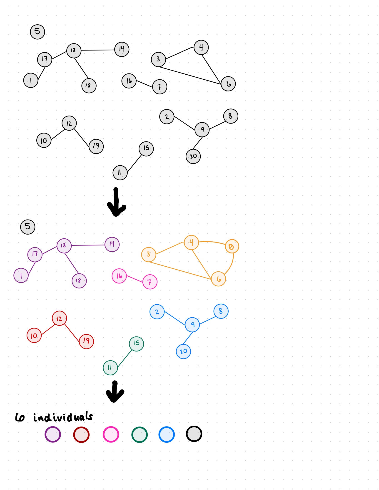

# CSE583_final_project

# Task 1: Create a simulation adjacency matrix (Courtney)

I have committed a .py script to our Github that creates a 21x21 matrix representing 21 nodes. 
All possible edges (is that the right term?) are represented by 0s (no known connection) or 1s (known connection).
In this matrix there are no 'maybes'. We'll add those later. There should be 6 identifiable individuals from this matrix. 

I am Jiangyue Wang, my task in this branch is to iterate all uncertain relationships to get all possible graphs.